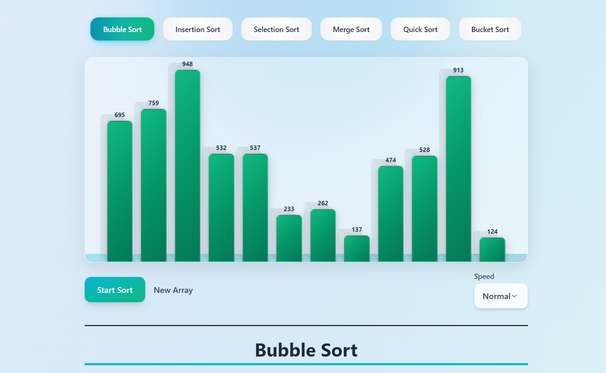
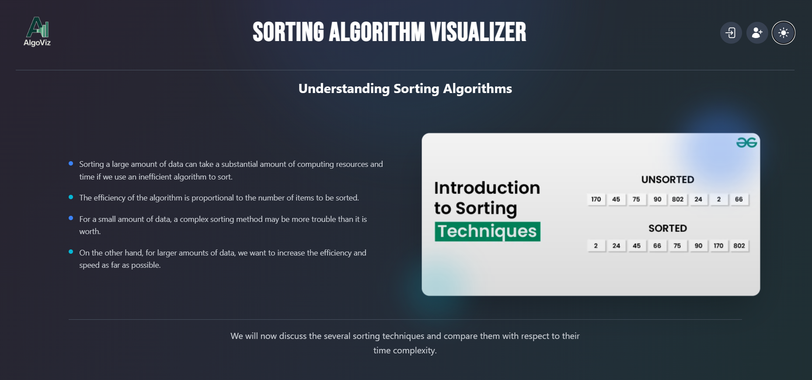

# 🔢 AlgoViz – Visualize Sorting Algorithms in Action

**AlgoViz** is a modern, interactive web application designed to visualize sorting algorithms in real time. Built with **React** and **Tailwind CSS**, AlgoViz offers learners, educators, and developers an intuitive way to understand how sorting algorithms work under the hood—step by step, visually and dynamically.

---

## ✨ Key Features

- 🎞️ **Real-Time Visualizations** – Watch algorithms sort data live with smooth animations.
- 🔘 **Multiple Algorithms Supported**:
  - Bubble Sort  
  - Selection Sort  
  - Insertion Sort  
  - Merge Sort  
  - Quick Sort  
- ⏩ **Adjustable Speed Control** – Learn at your own pace.
- 🎲 **Random Array Generator** – Shuffle arrays with one click.
- 📚 **Educational Tooltips** – Includes time and space complexity insights.
- 🌗 **Dark/Light Mode** – Seamless theme toggle for better accessibility.
- 📱 **Fully Responsive** – Optimized for desktop, tablet, and mobile devices.

---

## 🚀 Live Demo

👉 **[Explore AlgoViz Live](https://algo-viz-sigma.vercel.app/)**

---

## 🛠️ Tech Stack

- **Frontend**: React, Tailwind CSS  
- **Animations**: CSS transitions + asynchronous JavaScript delays  
- **Deployment**: GitHub Pages (or Vercel)

---

## 📷 Screenshots

| Sorting in Action | Dark Mode |
|-------------------|-----------|
|  |  |

---

## 🎯 Who Is It For?

- 👨‍🎓 **Students** learning fundamental sorting algorithms  
- 👩‍💻 **Developers** brushing up on algorithmic thinking  
- 📊 **Educators** seeking interactive teaching tools  
- 🔍 **Anyone** curious about how sorting works behind the scenes

**AlgoViz** transforms learning into an engaging, hands-on experience.

---

## 🤝 Contributors

- **Kafiul Islam**  
- **Aya el Assal** 

---

## 📄 License

This project is licensed under the **MIT License** – free to use, modify, and distribute.

---

## 🏷️ Tagline

> **AlgoViz — Where Algorithms Come to Life.**
